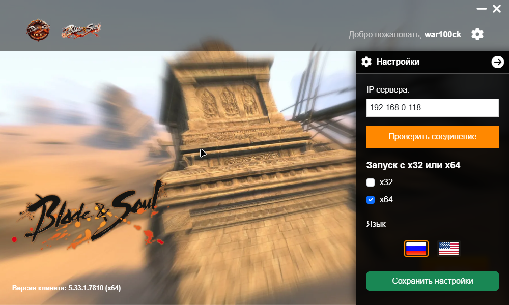

 


# 🎮 Blade & Soul Game Launcher (Tauri Edition)

> ⚠️ **ВАЖНОЕ ПРИМЕЧАНИЕ**  
> Данный лаунчер работает **ТОЛЬКО с BNS API**.  
> Он не совместим с официальными серверами NCSoft и не предназначен для подключения к ним.

> Prohibition of RAGEZONE Distribution. Distribution, publication, or sharing
> of download links to this Software (or its substantial portions) on the
> RAGEZONE forum or any related platforms is strictly prohibited.

---




Современный, легковесный и высокопроизводительный лаунчер для Blade & Soul, построенный на базе **Tauri v1** (Rust + Vanilla JS/HTML/CSS). Является переосмыслением оригинальной Electron-версии с сохранением всей функциональности и UI/UX, но с кратно меньшим размером дистрибутива и нативной производительностью.

---

## ✨ Основные возможности

### 🚀 Ядро
- **Легковесный рантайм** — дистрибутив ~8 МБ вместо ~150 МБ у Electron-версии
- **Нативное управление окном** — сворачивание, закрытие, перетаскивание через Tauri Window API
- **Запуск игрового клиента** — поддержка архитектур x32 (BIN/) и x64 (BIN64/) с параметрами `/SessKey /LaunchByLauncher /LoginMode 2 /ProxyIP:<IP> -UnAttended`
- **Чтение версии клиента** — из `BIN/Version.ini` или `BIN64/Version.ini` в зависимости от выбранной архитектуры
- **Автозакрытие лаунчера** после успешного запуска игры

### 🌍 Мультиязычность (RU / EN)
- **Два языка интерфейса** — русский и английский
- **Переключатель флагов** — компактные прямоугольные иконки в панели настроек
- **Локализованные уведомления** — все toastr-сообщения переводятся на лету
- **Автосохранение языка** — между сессиями через `localStorage` и `config.json`

### 🔐 Безопасность
- **Шифрование данных** — AES-256-CBC с ключом, сгенерированным через scrypt (параметры: N=16384, r=8, p=1)
- **Совместимость с Node.js** — алгоритм полностью идентичен `crypto.scryptSync` из Electron-версии
- **Хранение авторизации** — никнейм пользователя сохраняется в зашифрованном виде в `data/data.json`

### 📡 Сеть
- **Проверка соединения** — TCP-пинг на порт 3000 с таймаутом 500мс (в 4 раза быстрее Electron-версии)
- **Загрузка данных лаунчера** — fetch JSON с эндпоинта `/api/launcher-data`
- **Загрузка изображений** — конвертация в base64 для кэширования и мгновенного рендеринга
- **Регистрация и вход** — через приватный BNS API (`/signup`, `/signin`)
- **Открытие ссылок** — в системном браузере через Tauri Shell API (`cmd /C start`), без дублирования вкладок

### 🎨 Интерфейс
- **Bootstrap-карусель** — 4 статичных слайда
- **Анимированная полоса загрузки** — оранжевый градиент с движущимися полосками
- **Кнопка Play с эффектом заполнения** — градиентная подсветка по готовности
- **Выезжающие боковые панели** — настройки и регистрация/вход с blur-эффектом
- **Toastr-уведомления** — в левом верхнем углу, с прогресс-баром и автозакрытием
- **Отключение автозаполнения** — браузер не сохраняет введённые данные в полях форм

---

## 🛠 Стек технологий

| Компонент | Технология | Версия |
|---|---|---|
| **Backend** | Rust + Tokio + Reqwest | 1.70+ |
| **Frontend** | Vanilla JS (ES6+), HTML5, CSS3 | — |
| **Framework** | Tauri (WebView2) | 1.6 |
| **UI-библиотеки** | Bootstrap 5, FontAwesome 6, Toastr 2, jQuery 3.7 | — |
| **Шифрование** | AES-256-CBC + scrypt | crates: `aes`, `cbc`, `scrypt` |
| **Платформа** | Windows 10/11 (x64) | — |

---

## 📦 Требования к окружению

- [Rust](https://www.rust-lang.org/tools/install) (stable toolchain)
- [Node.js](https://nodejs.org/) (v16+, только для сборки)
- [WebView2 Runtime](https://developer.microsoft.com/en-us/microsoft-edge/webview2/) (встроен в Windows 10/11)
- **Visual Studio C++ Build Tools** (требуется Rust на Windows)
- Приватный BNS API-сервер, работающий на порту `3000`

---

## 📁 Структура проекта

```
bns-launcher/
├── src-tauri/
│   ├── src/
│   │   └── main.rs              # Rust-бэкенд (команды, ФС, HTTP, WinAPI)
│   ├── Cargo.toml               # Rust-зависимости
│   ├── tauri.conf.json          # Конфигурация окна и безопасности
│   ├── build.rs                 # Tauri build script
│   └── icons/
│       ├── icon.ico             # Windows-иконка
│       └── *.png                # Иконки разных размеров
├── src/
│   ├── index.html               # Главная разметка
│   ├── css/
│   │   └── styles.css           # Стили (оригинал из Electron)
│   ├── js/
│   │   └── script.js            # Логика UI, переводы, IPC
│   ├── libs/
│   │   ├── bootstrap/           # Bootstrap 5
│   │   ├── fontawesome/         # FontAwesome 6
│   │   ├── jquery/              # jQuery 3.7
│   │   └── toastr/              # Toastr 2
│   └── assets/
│       ├── images/
│       │   ├── slide/           # Слайды карусели
│       │   ├── flag/            # Флаги RU/EN
│       │   └── *.png, *.webp    # Логотипы, текстуры
│       └── sounds/
│           └── error.mp3        # Звук ошибки
├── data/                        # Создаётся автоматически
│   ├── config.json              # IP, архитектура, язык
│   └── data.json                # Зашифрованный никнейм
├── BIN/                         # Игровой клиент x32
│   ├── Client.EXE
│   └── Version.ini
├── BIN64/                       # Игровой клиент x64
│   ├── Client.EXE
│   └── Version.ini
├── build.bat                    # Production-сборка с очисткой кэша
├── dev.bat                      # Запуск dev-среды
└── README.md
```

---

## 🚀 Установка и запуск

### 1. Клонирование репозитория

```bash
git clone <your-repo-url>
cd bns-launcher
```

### 2. Подготовка ресурсов

- Скопируйте игровые клиенты в папки `BIN/` (x32) и `BIN64/` (x64)
- Создайте файлы `BIN/Version.ini` и `BIN64/Version.ini` с содержимым:
  ```ini
  [Version]
  ProductVersion=1.0.0
  ```
- Положите флаги `Russia-flag.png` и `United-states-flag.png` в `src/assets/images/flag/`
- Положите звук `error.mp3` в `src/assets/sounds/`
- Скопируйте библиотеки Bootstrap, FontAwesome, jQuery, Toastr в `src/libs/`

### 3. Запуск в режиме разработки

```bash
cargo tauri dev
```

Или используйте готовый скрипт:

```bash
dev.bat
```

### 4. Production-сборка

```bash
cargo tauri build
```

Или используйте готовый скрипт с очисткой кэша:

```bash
build.bat
```

Готовые бинарники и установщик появятся в `src-tauri/target/release/bundle/`.

---

## 🌐 Ожидания от API-сервера

Лаунчер взаимодействует с приватным BNS API-сервером по следующему протоколу (`http://<IP>:3000`):

| Метод | Эндпоинт | Формат запроса / ответа |
|---|---|---|
| `POST` | `/signup` | `{ "account_name": "...", "email": "...", "account_password": "..." }` |
| `POST` | `/signin` | `{ "signin_email": "...", "signin_password": "..." }` → возвращает `nickname` |
| `GET` | `/api/launcher-data` | JSON: `{ "sliders": [...], "mainBanner": "...", "logos": {...}, "news": [...] }` |
| `GET` | `/api/images/*` | Бинарные данные изображений (конвертируются в base64) |

---

## 🔐 Схема шифрования

Данные авторизации хранятся в `data/data.json` в формате:

```
<iv_hex>:<ciphertext_hex>
```

**Параметры:**
- **Алгоритм**: AES-256-CBC
- **Деривация ключа**: scrypt (password: `my_secret_key`, salt: `salt`, N=16384, r=8, p=1, dkLen=32)
- **IV**: 16 случайных байт, генерируемых при каждом шифровании
- **Padding**: PKCS#7

Эта схема **полностью совместима** с оригинальной Electron-версией — файлы `data.json` можно переносить между версиями без перешиврования.

---

## 🎮 Архитектура клиента

Лаунчер поддерживает две версии клиента:

| Архитектура | Папка | Файл версии | Исполняемый файл |
|---|---|---|---|
| **x32** | `BIN/` | `BIN/Version.ini` | `BIN/Client.EXE` |
| **x64** | `BIN64/` | `BIN64/Version.ini` | `BIN64/Client.EXE` |

При запуске игры лаунчер передаёт клиенту следующие аргументы:

```
/SessKey /LaunchByLauncher /LoginMode 2 /ProxyIP:<IP> -UnAttended
```

---

## 🌍 Мультиязычность

Система переводов реализована через объект `translations` в `script.js` с атрибутами `data-i18n`, `data-i18n-placeholder`, `data-i18n-title` в HTML.

### Поддерживаемые языки

| Код | Язык | Флаг |
|---|---|---|
| `ru` | Русский | 🇷🇺 Russia-flag.png |
| `en` | English | 🇬🇧 United-states-flag.png |

### Расширение на новые языки

Чтобы добавить новый язык (например, немецкий):

1. Добавьте ключ `de` в объект `translations` в `script.js`
2. Добавьте `<button>` с `data-lang="de"` в блок `.language-switcher`
3. Положите файл флага в `src/assets/images/flag/`

---

## 📊 Сравнение с Electron-версией

| Параметр | Electron | Tauri | Улучшение |
|---|---|---|---|
| Размер дистрибутива | ~150 МБ | ~8 МБ | **×18 меньше** |
| Холодный старт | ~2-3 сек | ~0.5 сек | **×4-6 быстрее** |
| RAM в простое | ~150-200 МБ | ~30-50 МБ | **×4 меньше** |
| Runtime | Node.js + Chromium | WebView2 + Rust | Нативный |
| Таймаут пинга | 2000 мс | 500 мс | **×4 быстрее** |
| Шифрование | crypto (Node.js) | aes+scrypt (Rust) | Совместимо |

---

## 📜 Лицензия и отказ от ответственности

Данный проект распространяется **только для образовательных и личных целей**.  
Разработчики не несут ответственности за использование кода в коммерческих проектах или нарушение условий использования оригинальной игры.  
Проект **не аффилирован** с NCSoft или официальными представителями Blade & Soul.

---

> 💡 *Если вы нашли баг или хотите предложить улучшение — создавайте Issue или Pull Request. Спасибо за поддержку!*